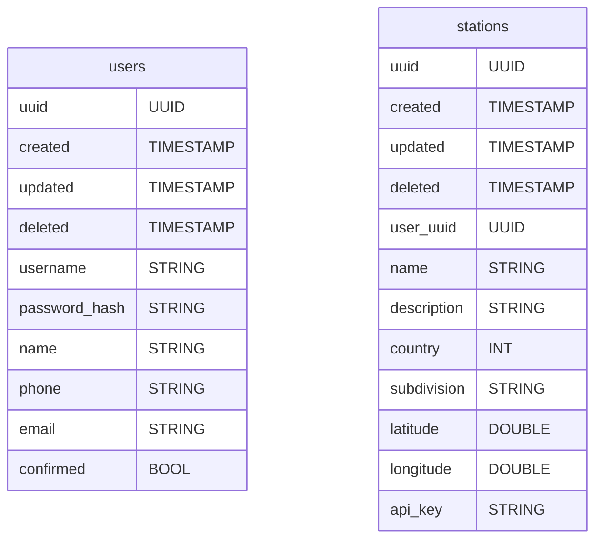
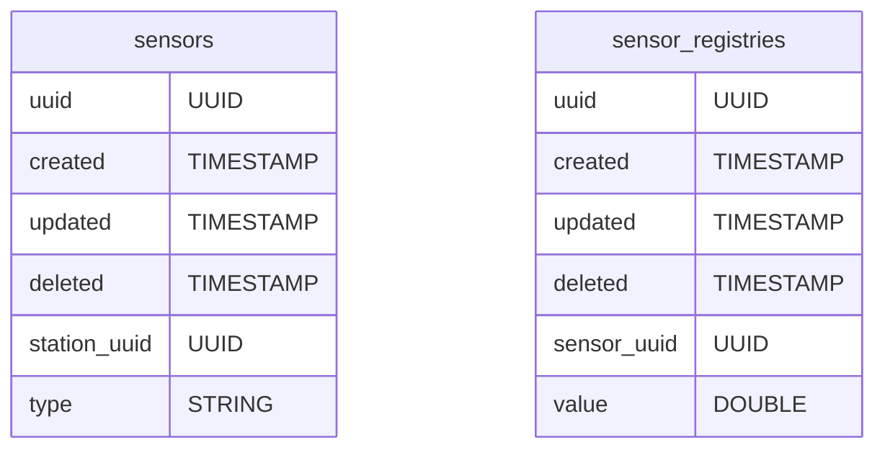
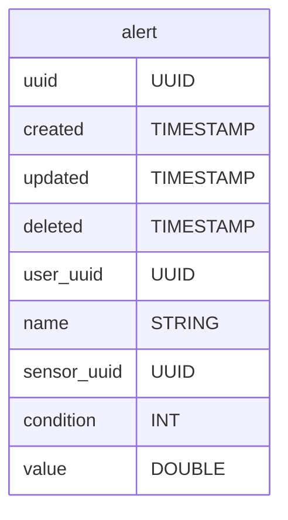
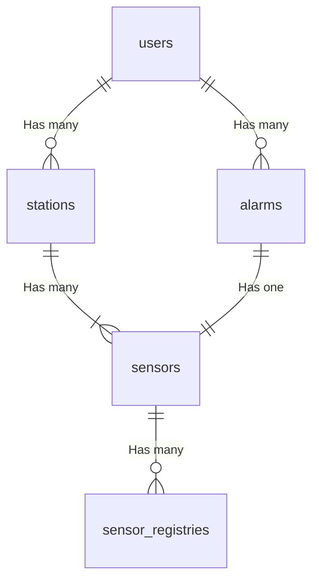
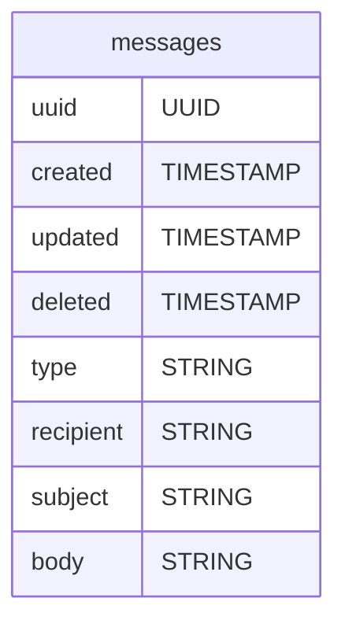

# Database

This document describes the relation database used in the entire system.

## Stations

### Tables

### Relations

### Table rows and their Types

#### Sensors

| Type | Number |
| ---- | ------ |
|      |        |

#### Conditions

| Type | Number |
| ---- | ------ |
| `<`  | 0      |
| `>`  | 1      |
| `<=` | 2      |
| `>=` | 3      |

## Messaging

### Tables

