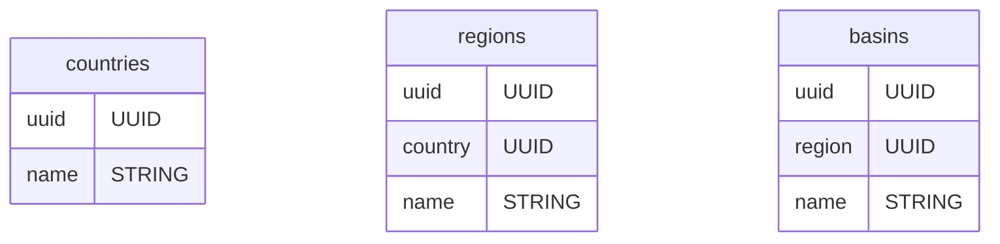
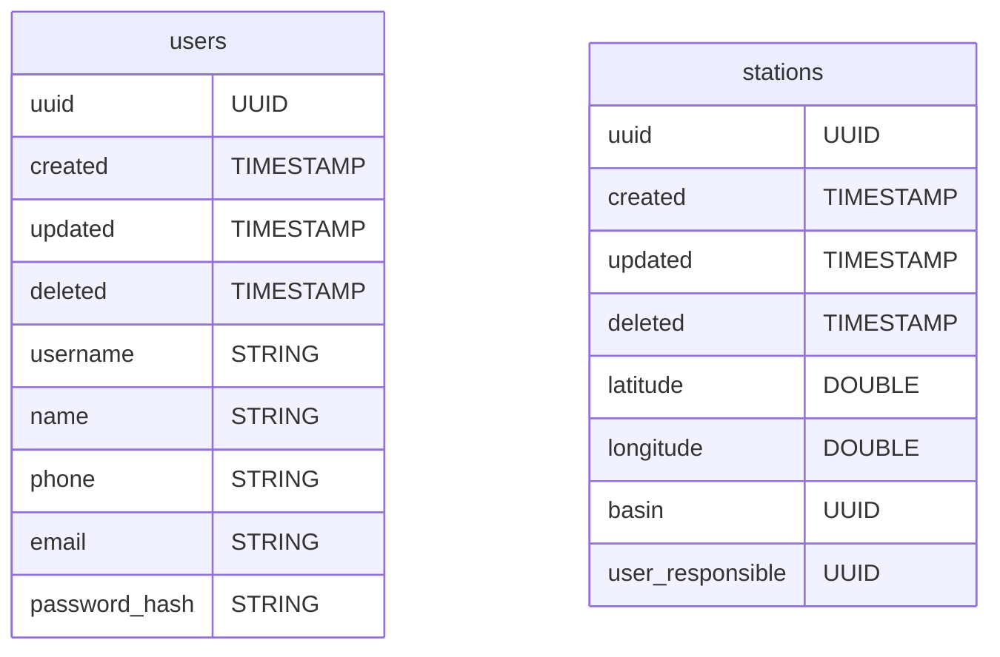
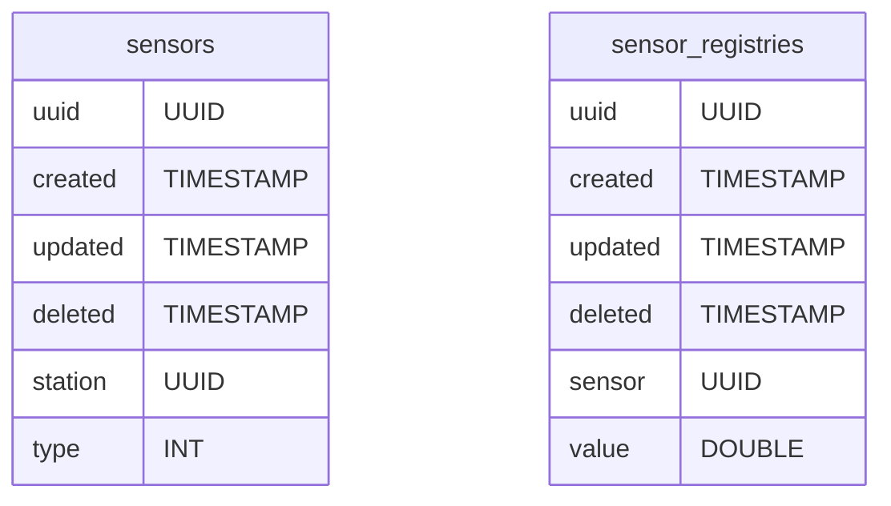
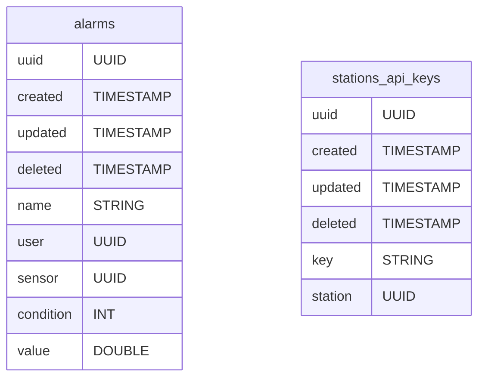
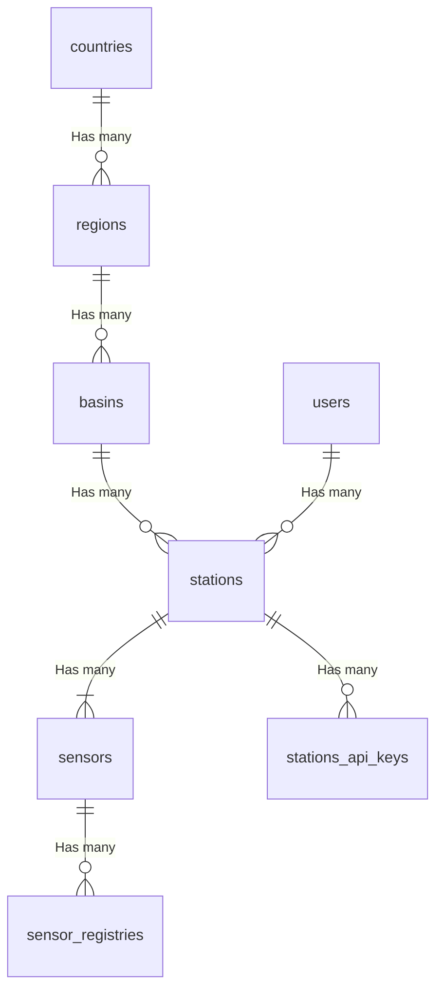
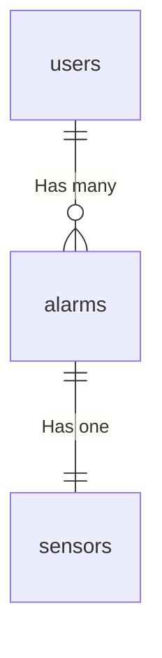

# Database

This document describes the relation database used in the entire system.

## Tables

## Relations

### Stations organization

### Alarms

## Table rows and their Types

### Sensors

| Type | Number |
| ---- | ------ |
|      |        |

### Conditions

| Type | Number |
| ---- | ------ |
| `<`  | 0      |
| `>`  | 1      |
| `<=` | 2      |
| `>=` | 3      |

