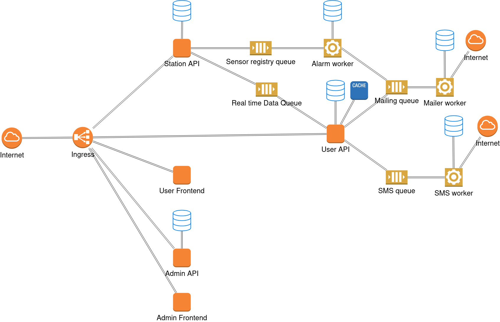

# docs

Repository containing all the documentation of the entire system surrounding hidromatologia

## Architecture

## Documents

| Document                                                     | Description                                                  |
| ------------------------------------------------------------ | ------------------------------------------------------------ |
| [Database.md](Database.md)                                   | Database entity relationship diagrams                        |
| [CICD.md](https://github.com/hidromatologia-v2/docs/blob/main/CICD.md) | Documentation about the CI/CD pipelines implemented in the project. |
| [CONTRIBUTING.md](https://github.com/hidromatologia-v2/docs/blob/main/CONTRIBUTING.md) | Contribution manual.                                         |
| [Use cases.md](https://github.com/hidromatologia-v2/docs/blob/main/Use%20cases.md) | System use cases                                             |
| [microservices.drawio](https://github.com/hidromatologia-v2/docs/blob/main/microservices.drawio) | Infrastructure diagram                                       |
| [diagrams.mdj](https://github.com/hidromatologia-v2/docs/blob/main/diagrams.mdj) | Use case, packages and deployment diagrams in **StarUML**.   |

